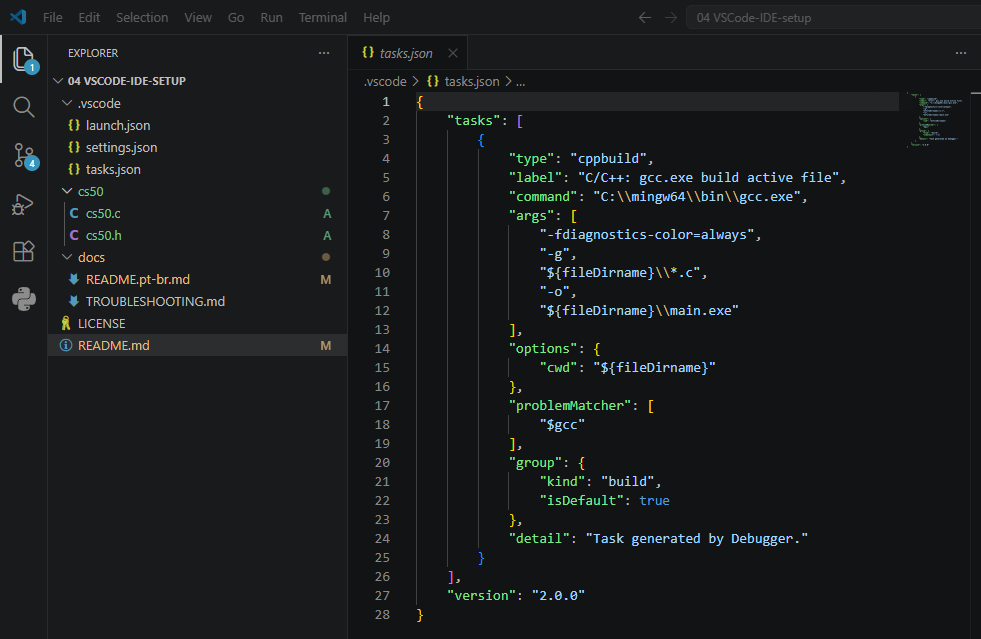

# 💻 VSCode IDE setup
My VSCode setup for C, Python and SQLite development, extending Harvard CS50's workflow.

[**PT-BR**](./docs/README.pt-br.md)



## 📦 Dependencies
- [VSCode](https://code.visualstudio.com/download)
- [MinGW](https://www.mingw-w64.org/downloads/)
- [Python](https://www.python.org/downloads/)

## 🚀 Getting Started
<details>
  <summary>⚙️ MinGW Setup for C</summary>
  
  - Add `C:\mingw64\bin` to the PATH system environment variable;
  - Install the **VSCode C/C++ Extension Pack**;
  - Configure `launch.json`, `settings.json`, and `tasks.json` in the `.vscode` workspace (reference the [**.vscode directory**](./.vscode/)).

> 💡**Passing multiple arguments while debugging:** Separate each argument with double quotes or the VSCode IDE will interpret as a single argument string with spaces. Example: "argument1" "argument2" 

> 💡 **Using the CS50 Library:** If you need to run legacy code that uses the CS50 library, simply copy the `cs50.h` and `cs50.c` files from the [**cs50 directory**](./cs50/) directly into your active project folder.

</details>

<details>
  <summary>🐍 Python Setup</summary>
  
  - Install latest stable **Python** version and ensure it's added to the System PATH;
  - Install the **Python Extension** for VSCode.

</details>

<details>
  <summary>🗄️ SQLite Setup</summary>

  - Install the [SQLite](https://marketplace.visualstudio.com/items?itemName=alexcvzz.vscode-sqlite) VS Code extension by alexcvzz;
  - SQLite comes bundled with Python — confirm it is working by running:
```bash
    python -c "import sqlite3; print(sqlite3.sqlite_version)"
```

</details>

## 🔧 Troubleshooting
Common issues and their solutions.

[Full Troubleshooting Guide](./docs/TROUBLESHOOTING.md)

### Visual Studio Code C/C++ debug error (System.Security.SecurityException: Falha na validação de nome forte)
- **Problem:** Unable to start debugging. Unable to establish a connection to GDB. Debug output may contain more information.
- **Solution:** In the VSCode extensions tab, click "Switch to release version" and restart VSCode.
